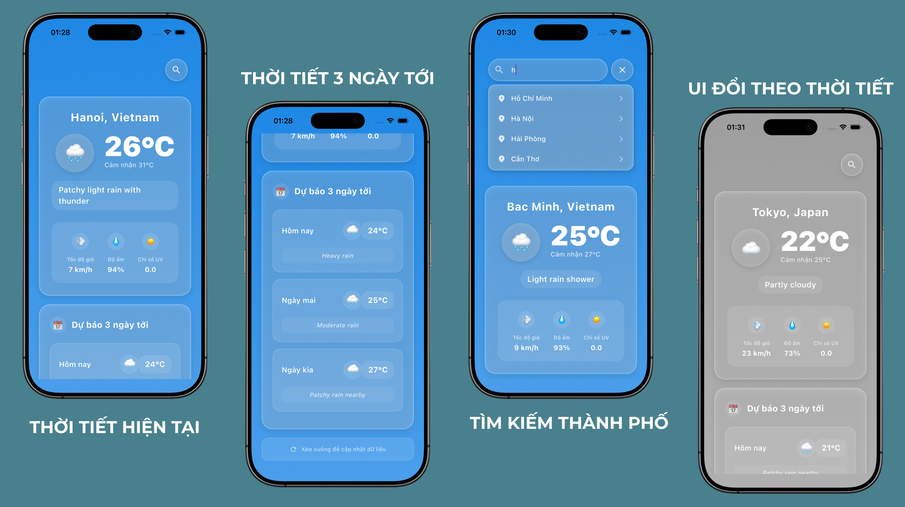

# 🌤️ Ứng Dụng Dự Báo Thời Tiết

Ứng dụng thời tiết toàn diện được xây dựng bằng **Flutter & Dart**, tích hợp **Weather API**, sử dụng **Provider** cho quản lý trạng thái và **HTTP Client** để giao tiếp với RESTful API. Dự án thể hiện các phương pháp phát triển di động hiện đại, **Clean Architecture**, **JSON Parsing**, và **Material Design 3**.

## 📱 Tổng Quan

Dự án này giới thiệu một ứng dụng thời tiết đầy đủ chức năng được xây dựng bằng Flutter, bao gồm dữ liệu thời tiết thời gian thực, dự báo và giao diện thân thiện với người dùng. Ứng dụng thể hiện khả năng thành thạo trong phát triển di động, tích hợp API, quản lý trạng thái và các nguyên tắc thiết kế UI/UX hiện đại.

## 📸 Demo Ứng Dụng



## ✨ Tính Năng

- **Dữ Liệu Thời Tiết Thời Gian Thực**: Thông tin thời tiết hiện tại với các chỉ số chi tiết
- **Tìm Kiếm Thành Phố**: Tìm kiếm và xem thời tiết của bất kỳ thành phố nào trên thế giới
- **Dự Báo Thời Tiết**: Dự báo thời tiết mở rộng
- **Giao Diện Đáp Ứng**: Thiết kế thích ứng hoạt động trên nhiều kích thước màn hình khác nhau
- **Material Design Hiện Đại**: Giao diện người dùng sạch sẽ và trực quan
- **Quản Lý Trạng Thái**: Xử lý trạng thái hiệu quả sử dụng mô hình Provider
- **Tích Hợp API**: Sử dụng RESTful API với xử lý lỗi phù hợp

## 🏗️ Kiến Trúc & Điểm Nổi Bật Kỹ Thuật

### **Triển Khai Kiến Trúc Sạch (Clean Architecture)**

- **Models**: Cấu trúc dữ liệu với serialization JSON hợp lý
- **Services**: Lớp giao tiếp API với HTTP client
- **Providers**: Quản lý trạng thái sử dụng mô hình Provider
- **Screens**: Lớp trình bày UI
- **Widgets**: Các thành phần UI có thể tái sử dụng

### **Các Khái Niệm Kỹ Thuật Chính Được Thể Hiện**

- ✅ **Quản Lý Trạng Thái**: Mô hình Provider cho cập nhật UI phản ứng
- ✅ **Tích Hợp API**: Yêu cầu HTTP với xử lý lỗi phù hợp
- ✅ **Phân Tích JSON**: Mô hình dữ liệu type-safe với factory constructors
- ✅ **Tích Hợp Widget**: Thành phần UI modular và có thể tái sử dụng
- ✅ **Thiết Kế Đáp Ứng**: Bố cục thích ứng cho các kích thước màn hình khác nhau
- ✅ **Material Design**: Tuân theo các nguyên tắc thiết kế của Flutter

## 🛠️ Công Nghệ Sử Dụng

- **Framework**: Flutter 3.8.1+
- **Ngôn Ngữ**: Dart
- **Quản Lý Trạng Thái**: Provider 6.1.1+
- **HTTP Client**: http 1.1.0+
- **Kiến Trúc**: Clean Architecture / MVVM pattern
- **Hệ Thống Thiết Kế**: Material Design 3

## 📁 Cấu Trúc Dự Án

```text
lib/
├── main.dart
├── models/
│   └── weather_model.dart              # Mô hình dữ liệu
├── providers/
│   └── weather_provider.dart           # Quản lý trạng thái
├── screens/
│   └── weather_screen.dart             # Màn hình chính
├── services/
│   └── weather_service.dart            # Lớp dịch vụ API
└── widgets/
    ├── current_weather_card.dart       # Hiển thị thời tiết hiện tại
    ├── forecast_weather_card.dart      # Hiển thị dự báo
    └── search_city_widget.dart         # Thành phần tìm kiếm thành phố
```

## 🚀 Bắt Đầu

### Yêu Cầu Tiên Quyết

- Flutter SDK (3.8.1 trở lên)
- Dart SDK
- iOS Simulator hoặc Thiết bị Thật (Hiện tại chỉ phát hành cho IOS)

### Cài Đặt

1. **Clone repository**

   ```bash
   git clone [https://github.com/dd-datt/weather_app_demo.git]
   cd weather_demo
   ```

2. **Cài đặt dependencies**

   ```bash
   flutter pub get
   ```

3. **Chạy ứng dụng**

   ```bash
   flutter run
   ```

## 🔧 Thực Hành Phát Triển

### **Chất Lượng Code**

- Tuân theo hướng dẫn style của Dart/Flutter
- Triển khai xử lý lỗi phù hợp
- Sử dụng quy ước đặt tên có ý nghĩa
- Bao gồm tài liệu toàn diện

### **Tối Ưu Hóa Hiệu Suất**

- Rebuild widget hiệu quả với Provider
- Giải phóng tài nguyên phù hợp
- Tối ưu hóa yêu cầu mạng

### **Cân Nhắc Khả Năng Mở Rộng**

- Kiến trúc modular để dễ dàng thêm tính năng
- Tách biệt các mối quan tâm
- Thiết kế thành phần có thể tái sử dụng

## 🎯 Kỹ Năng Được Thể Hiện

Dự án này thể hiện sự thành thạo trong:

- **Phát Triển Mobile**: Phát triển ứng dụng đa nền tảng với Flutter
- **Tích Hợp API**: Dịch vụ RESTful và xử lý JSON
- **Quản Lý Trạng Thái**: Mô hình lập trình phản ứng
- **Thiết Kế UI/UX**: Triển khai Material Design
- **Clean Code**: Kiến trúc code có thể bảo trì và mở rộng
- **Giải Quyết Vấn Đề**: Xử lý các trường hợp edge case và lỗi
- **Version Control**: Thực hành tốt nhất với Git

## 🔄 Cải Tiến Tương Lai

Các cải tiến và tính năng tiềm năng có thể được thêm vào:

- [ ] Offline caching để cải thiện trải nghiệm người dùng
- [ ] Phát hiện thời tiết dựa trên vị trí
- [ ] Cảnh báo và thông báo thời tiết
- [ ] Hỗ trợ nhiều theme (dark/light mode)
- [ ] Tích hợp bản đồ thời tiết
- [ ] Dữ liệu thời tiết lịch sử
- [ ] Coverage unit tests
- [ ] Thiết lập CI/CD pipeline

## 👨‍💻 Hồ Sơ Nhà Phát Triển

Dự án này thể hiện khả năng của tôi trong việc:

- Xây dựng ứng dụng di động production-ready
- Triển khai các mô hình phát triển hiện đại
- Tạo ra code sạch sẽ, có thể bảo trì
- Xử lý quản lý trạng thái phức tạp
- Tích hợp API bên ngoài hiệu quả
- Thiết kế giao diện người dùng trực quan

---

- **Tác giả**: @dd-datt
- **Email**: <vdat319@gmail.com>
